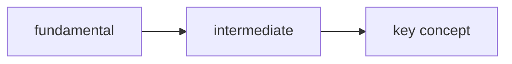

# Learning Path: [Paper or Topic Title]

> **Source:** [link or citation]
> **Goal:** Understand the key claims below by closing the prerequisite gap.

## Key Claims (the targets)

What the paper actually asserts, in plain language. These are the sinks of the DAG.

1. [Claim 1]
2. [Claim 2]

## Concept DAG

Concepts required to understand the claims, fundamental → advanced.
Edge `A -> B` = B requires A. Use a fenced list or mermaid.

## Frontier Assessment

What probing revealed about where known knowledge ends.

| Concept | Depth | Status | Evidence |
|---------|-------|--------|----------|
| ... | fundamental | KNOWN | probe Q1 correct |
| ... | intermediate | UNKNOWN | probe Q2 wrong (chose distractor: ...) |

**Frontier:** [the boundary concepts the learner knows]

## The Gap (Curriculum)

Topologically-sorted list of UNKNOWN concepts on the path from frontier to key
claims. This is the teaching sequence.

- [ ] 1. [concept] — [one-line why it's needed]
- [ ] 2. [concept] — ...
- [ ] 3. [concept] — ...

## Progress Log

Per-concept teaching record. Update as each concept is completed.

### [Concept name] — ✅ passed / 🔄 in progress
- **Taught:** [date]
- **Worked example used:** [brief note]
- **Gate result:** [passed first try / re-taught after misconception X]
- **Key takeaway:** [the one-sentence summary the learner should retain]

## Session Notes

- Concepts deferred to a later session: [...]
- Resume point: [...]
