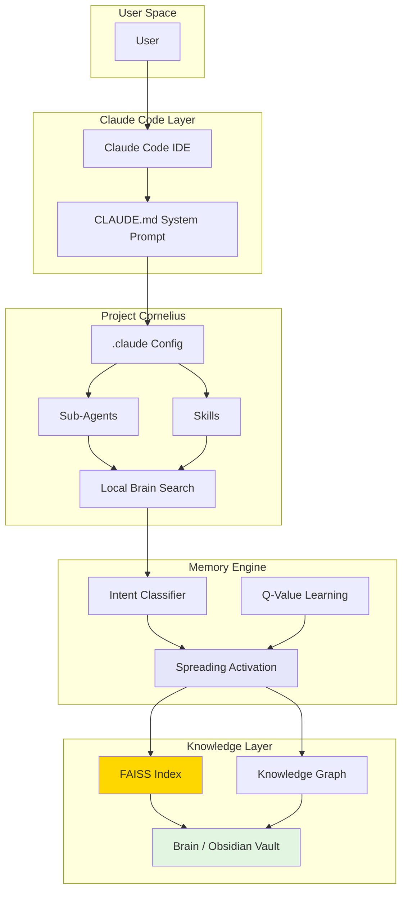

# Project Cornelius

**AI-powered second brain template for Claude Code + Obsidian**

Capture insights, discover connections, and synthesize knowledge - with AI assistance.

## What's New in v03.26

- **SYNAPSE-inspired memory** - Spreading activation search with intent classification and usage-based learning
- **Dialectic engine** - Two sub-agents argue committed positions while orchestrator synthesizes
- **Autonomous research** - `/learn-new-things` runs full research cycles with git branching
- **Insight graduation** - `/graduate-insights` promotes draft notes to permanent status with Zettelkasten criteria
- **30 skills** for insight capture, connection discovery, research, and content creation
- **10 specialized sub-agents** for different knowledge tasks
- **Q-value learning** - Search rankings improve over time based on actual usage patterns
- **Trinity-compatible** - Can be deployed to the Trinity agent orchestration platform

---

## TL;DR

**Project Cornelius** = Claude Code + Custom Agents + Obsidian + FAISS Vector Search

It's like having a highly specialized AI research assistant that:
- **Finds hidden connections** in your notes you didn't know existed
- **Writes articles** from your accumulated insights
- **Captures unique thoughts** while preserving your voice
- **Discovers patterns** across different domains of knowledge
- **Learns from you** - search rankings improve based on your actual usage
- **Researches autonomously** - can run research cycles and expand your knowledge base
- **Evolves with you** through Git-tracked configurations

---

## What is Project Cornelius?

Project Cornelius is a **multi-layered knowledge management system** that creates an intelligent bridge between your thinking and AI assistance. It's an agent-within-an-agent architecture that transforms Claude Code into a specialized second brain operator.

### The Layer Cake Architecture

```
┌─────────────────────────────────────────┐
│         Human (You)                     │
├─────────────────────────────────────────┤
│         Claude Code                     │ ← General AI assistant
├─────────────────────────────────────────┤
│     Project Cornelius Agent             │ ← Specialized for knowledge work
│     (Defined by CLAUDE.md)              │
├─────────────────────────────────────────┤
│     Specialized Sub-Agents              │ ← Task-specific capabilities
│  (vault-manager, connection-finder...)  │
├─────────────────────────────────────────┤
│     Local Brain Search (FAISS)          │ ← Vector search + memory engine
├─────────────────────────────────────────┤
│         Your Knowledge Base             │ ← Your actual "brain"
│        (Obsidian Vault/Brain)           │
└─────────────────────────────────────────┘
```

### Key Features

**Insight Capture**
- Extract unique insights from books, articles, and conversations
- Preserve your authentic voice and reasoning patterns
- Distinguish between your original thinking and borrowed ideas

**Connection Discovery**
- Find non-obvious relationships between notes
- Identify consilience zones where multiple domains converge
- Surface cross-domain bridges and synthesis opportunities

**Content Generation**
- Synthesize notes into articles and frameworks
- Generate talking points and outlines
- Create content from your accumulated knowledge

**SYNAPSE-Inspired Memory Search**
- FAISS-powered semantic search (fast, local, no API calls)
- Intent-aware query classification (factual/conceptual/synthesis/temporal)
- Spreading activation with lateral inhibition
- Usage-based Q-value learning - rankings improve with use
- Graph analytics: hubs, bridges, centrality
- Explicit (wiki-links) and semantic edge distinction

---

## Quick Start

```bash
# 1. Clone this repository
git clone https://github.com/Abilityai/cornelius.git
cd cornelius

# 2. Configure your vault path
cp .claude/settings.md.template .claude/settings.md
# Edit .claude/settings.md and set your vault path:
# VAULT_BASE_PATH=./Brain  (or absolute path to your vault)

# 3. Set up Local Brain Search
cd resources/local-brain-search
python -m venv venv
source venv/bin/activate  # or venv\Scripts\activate on Windows
pip install -r requirements.txt

# 4. Index your vault
./run_index.sh

# 5. Start Claude Code
cd ../..
claude

# 6. (Optional) Seed your Brain from foundational documents
# Inside Claude Code:
/seed-brain /path/to/your/foundational-docs/
```

**Detailed guides:**
- [QUICKSTART.md](QUICKSTART.md) - 5-minute setup
- [INSTALL.md](INSTALL.md) - Detailed installation
- [MCP-SETUP.md](MCP-SETUP.md) - MCP server configuration (optional)

---

## What's Included

### Sub-Agents (`.claude/agents/`)

| Agent | Purpose |
|-------|---------|
| `vault-manager` | Create, read, update, delete notes with proper metadata |
| `connection-finder` | Find hidden relationships between notes (user-directed) |
| `auto-discovery` | Autonomous cross-domain connection hunter |
| `insight-extractor` | Extract insights from YOUR content (conversations, transcripts) |
| `document-insight-extractor` | Extract insights from EXTERNAL content (papers, books) |
| `thinking-partner` | Brainstorming and ideation support |
| `diagram-generator` | Create Mermaid visualizations |
| `local-brain-search` | FAISS-powered semantic search and graph analytics |
| `research-specialist` | Deep research with web search |
| `epub-chapter-extractor` | Extract content from ebooks |

### Skills (`.claude/skills/`)

**Search & Discovery**

| Skill | Command | Purpose |
|-------|---------|---------|
| `recall` | `/recall <topic>` | 3-layer semantic search with spreading activation |
| `search-vault` | `/search-vault <query>` | Quick semantic + keyword search |
| `find-connections` | `/find-connections <note>` | Map conceptual network |
| `auto-discovery` | `/auto-discovery` | Run cross-domain connection discovery |

**Insight Management**

| Skill | Command | Purpose |
|-------|---------|---------|
| `extract-insights` | `/extract-insights <file>` | Extract insights from YOUR content |
| `extract-document-insights` | `/extract-document-insights <file>` | Extract insights from external documents |
| `graduate-insights` | `/graduate-insights` | Promote notes to permanent status |
| `integrate-recent-notes` | `/integrate-recent-notes` | Connect recent notes to knowledge base |

**Content & Synthesis**

| Skill | Command | Purpose |
|-------|---------|---------|
| `create-article` | `/create-article <topic>` | Write article from notes |
| `get-perspective-on` | `/get-perspective-on <topic>` | Extract unique perspective |
| `synthesize-insights` | `/synthesize-insights` | Combine insights into narrative |
| `dialectic` | `/dialectic <question>` | Stress-test ideas with opposing positions |

**Research & Learning**

| Skill | Command | Purpose |
|-------|---------|---------|
| `deep-research` | `/deep-research <topic>` | Autonomous research pipeline |
| `learn-new-things` | `/learn-new-things [topic]` | Full research cycle with git branching |

**System & Maintenance**

| Skill | Command | Purpose |
|-------|---------|---------|
| `analyze-kb` | `/analyze-kb` | Generate structure report |
| `refresh-index` | `/refresh-index` | Rebuild FAISS index |
| `self-diagnostic` | `/self-diagnostic` | Health check |
| `git-commit-push` | `/git-commit-push` | Stage, commit, push with approval gate |
| `talk` | `/talk` | Conversational partner mode |
| `update-changelog` | `/update-changelog` | Update master CHANGELOG.md |
| `benchmark-memory` | `/benchmark-memory` | Benchmark search system |
| `test-memory-system` | `/test-memory-system` | Test memory improvements |
| `scheduled-run` | `/scheduled-run <skill>` | Wrapper for cron automation |
| `update-dashboard` | `/update-dashboard` | Update Trinity dashboard metrics |
| `seed-brain` | `/seed-brain <path>` | Ingest foundational docs into knowledge graph |

### Brain Seeding

Starting with an empty vault? `/seed-brain` bootstraps your knowledge graph from foundational documents (manifesto, frameworks, values, strategy docs, etc.).

It reads your source documents, proposes a decomposition into atomic permanent notes with cross-links, gets your approval, then creates everything - source notes, permanent notes, MOCs, and search index - in one pass. The result is a fully linked, searchable knowledge base ready for connection discovery and content creation.

```bash
# Inside Claude Code:
/seed-brain /path/to/your/foundational-docs/
```

### Sample Vault (`Brain/`)

Complete Zettelkasten structure with templates:

```
Brain/
├── 00-Inbox/              # Quick capture, unprocessed notes
├── 01-Sources/            # Literature notes, references
├── 02-Permanent/          # Atomic, evergreen notes (CORE)
├── 03-MOCs/               # Maps of Content
├── 04-Output/             # Articles, frameworks, insights
│   └── Articles/          # Each article in own folder
├── 05-Meta/               # System notes, changelogs
├── AI Extracted Notes/    # AI-extracted from YOUR content
└── Document Insights/     # AI-extracted from external content
```

### Local Brain Search (`resources/local-brain-search/`)

FAISS-powered vector search with SYNAPSE-inspired memory architecture:

```bash
# Semantic search (static mode - fast)
./run_search.sh "dopamine motivation" --limit 10 --json

# Spreading activation search (better for synthesis queries)
./run_search.sh "how does dopamine relate to decision making" --mode spreading --json

# Find connections
./run_connections.sh "Note Name" --json

# Graph analytics
./run_connections.sh --hubs --json    # Most connected notes
./run_connections.sh --bridges --json  # Cross-domain connectors
./run_connections.sh --stats --json    # Graph statistics

# Learning system status
./run_learning.sh status              # Q-value stats
./run_learning.sh top                 # Top notes by learned relevance

# Re-index after changes
./run_index.sh
```

**Memory Architecture:**
- **Intent Classification** - Routes queries as factual/conceptual/synthesis/temporal
- **Spreading Activation** - Propagates relevance through graph with lateral inhibition
- **Usage-Based Learning** - Q-values adjust rankings based on what you actually use
- **Configuration** - Single source of truth in `memory_config.py`

---

## Documentation

| File | Purpose |
|------|---------|
| [QUICKSTART.md](QUICKSTART.md) | 5-minute setup |
| [INSTALL.md](INSTALL.md) | Detailed installation & troubleshooting |
| [EXAMPLES.md](EXAMPLES.md) | Sample notes, MOCs, workflows |
| [FOLDER-STRUCTURE.md](FOLDER-STRUCTURE.md) | Vault organization guide |
| [MCP-SETUP.md](MCP-SETUP.md) | MCP server configuration |
| [Brain/README.md](Brain/README.md) | Sample vault guide |

---

## Use Cases

**Capture**: Extract insights from books and articles while reading
**Connect**: Find non-obvious relationships between ideas from different domains
**Create**: Synthesize notes into articles, frameworks, and presentations
**Discover**: Let AI find patterns you didn't know existed
**Research**: Autonomous research cycles that expand your knowledge base
**Evolve**: Track how your thinking changes over time

---

## Core Principles

**Atomic notes** - One idea per note, well-linked
**Your words** - Not copy-paste from sources
**Rich links** - Connect everything with `[[wiki-links]]`
**Regular discovery** - Run connection finder and auto-discovery
**Active synthesis** - Create content from your connections

---

## Requirements

- [Claude Code](https://claude.ai/claude-code) (CLI)
- [Obsidian](https://obsidian.md/) (for viewing/editing vault)
- Python 3.10+ (for Local Brain Search)
- Node.js 18+ (optional, for MCP servers)

---

## Architecture Overview



---

## Version History

| Version | Changes |
|---------|---------|
| v03.26 | SYNAPSE memory, dialectic engine, autonomous research, insight graduation, 30 skills |
| v02.25 | Skills architecture, FAISS search, remove Smart Connections |
| v01.25 | Initial release with commands, Smart Connections, basic search |

---

## License

MIT - Use, modify, distribute freely. See [LICENSE](LICENSE).

---

## Contributing

Contributions welcome! Please read the existing code style and structure before submitting PRs.

---

**Questions?** Check the docs above or start with [QUICKSTART.md](QUICKSTART.md)
