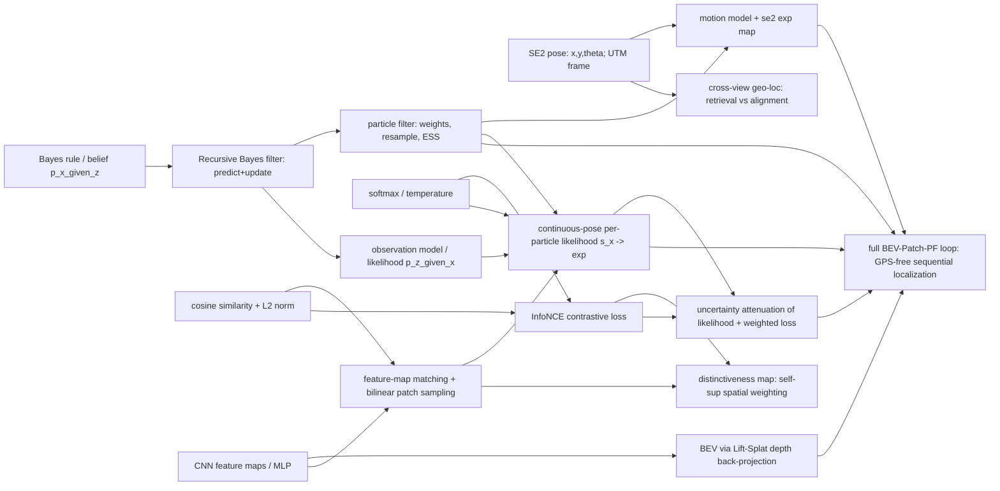

# Learning Path: BEV-Patch-PF (Cross-View Geo-Localization)

> **Source:** https://arxiv.org/abs/2512.15111
> **Goal:** Understand how a particle filter + learned BEV-aerial feature matching gives GPS-free global localization, scoring continuous pose hypotheses.

## Key Claims (the targets)

1. A particle filter whose observation model matches learned BEV features (from onboard RGB-D) to aerial feature patches sampled at each particle's pose gives accurate, GPS-free, vision-only global localization.
2. Computing the likelihood directly at each particle's **continuous** pose (bilinear-sampled aerial patch) is the core advantage over retrieval/grid methods, which only yield discretized, pose-insensitive scores.
3. A learned **frame-level uncertainty** adaptively flattens the observation likelihood on unreliable frames, preventing overconfident particle collapse.
4. Empirically: 9.7x / 6.6x lower ATE than a retrieval baseline; real-time 10 Hz on a Tesla T4.

## Concept DAG

Edge `A -> B` = B requires A. Fundamental (left) -> advanced (right).

## Frontier Assessment

| Concept | Depth | Status | Evidence |
|---------|-------|--------|----------|
| Bayes update (prior x likelihood -> normalize) | fundamental | KNOWN | probe R2-Q1 correct |
| SE(2) pose (x,y,theta) + compose motion | fundamental | KNOWN | probe R2-Q2 correct |
| CNN feature maps / MLP | fundamental | KNOWN | downward closure from BEV |
| BEV via Lift-Splat depth back-projection | intermediate | KNOWN | probe R1-Q3 correct |
| Cosine similarity + L2 normalization | fundamental | UNKNOWN | probe R1-Q2 wrong (chose ~0; misconception: magnitude mismatch = dissimilar) |
| Softmax / temperature | fundamental | UNKNOWN | probe R1-Q4 "not sure" |
| Particle filter (weights, resample, ESS) | intermediate | UNKNOWN | probe R1-Q1 "not sure" |
| InfoNCE contrastive loss | intermediate | UNKNOWN | inferred from F2/F5/PF unknown |
| Continuous-pose likelihood / uncertainty / distinctiveness | advanced | UNKNOWN | targets, above frontier |

**Frontier:** Bayes update + SE(2) pose + BEV/Lift-Splat. Learner is strong on the
representation and geometry side; gap is the probabilistic-filtering stack plus two
matching/scoring math fundamentals.

## The Gap (Curriculum)

Topologically sorted. Core path to the key claims = steps 1-6; step 7 is the
training-side extension.

- [x] 1. **Cosine similarity & L2 normalization** (F2) — the matching score is built on this; fixes the ~0 misconception
- [x] 2. **Softmax & temperature** (F5) — turns raw scores into a probability/likelihood; sharpness control
- [x] 3. **Particle filter** (I2) — extends known Bayes update to a cloud of weighted pose hypotheses; predict / update / resample / ESS
- [x] 4. **Feature-map matching + continuous-pose patch sampling** (I7) — cosine-match BEV grid to an aerial patch sampled at any (x,y,theta)
- [x] 5. **Continuous-pose per-particle observation likelihood** (A1) — s(x) -> exp(s/tau); THE core contribution (claim 2)
- [x] 6. **Frame-level uncertainty attenuation** (A2) — flatten the likelihood on unreliable frames (claim 3)
- [x] 7. *(extension)* **InfoNCE training + distinctiveness map** (I8/A3) — how the features and weights are actually learned

## Progress Log

### 1. Cosine similarity & L2 normalization — ✅ passed
- **Taught:** 2026-06-03
- **Worked example:** a=(3,4) vs b=(6,8) both normalize to (0.6,0.8) -> cosine 1.0; contrast cases gave 0 and -1.
- **Gate result:** passed all 3 first try (magnitude-invariance, the concept, interpreting 0).
- **Key takeaway:** cosine compares direction only; L2-norm deletes magnitude, so same-direction vectors score 1 regardless of length.

### 2. Softmax & temperature — ✅ passed
- **Taught:** 2026-06-03
- **Worked example:** scores [2,1,0] under tau=1/0.5/2 -> [.67,.24,.09]/[.87,.12,.02]/[.51,.31,.19]; limits one-hot vs uniform.
- **Gate result:** passed all 3 first try (lowering tau widens gap; raising tau keeps particles alive; output positive & sums to 1).
- **Key takeaway:** temperature is a contrast knob on scores; low tau sharpens to confidence, high tau flattens to hedge. Connects directly to claim 3's uncertainty flattening.

### 3. Particle filter — ✅ passed
- **Taught:** 2026-06-03
- **Worked example:** N=4 1D filter, full predict(+1m)/update(likelihood [.1,.3,1,.4])/normalize cycle -> w=[.056,.167,.556,.222], ESS=2.6/4=64% (no resample); then degenerate w -> ESS 32% -> resample.
- **Gate result:** passed all 3 first try (resample = redraw prop to weights; update = x observation likelihood; predict noise = imperfect odometry).
- **Key takeaway:** PF = Bayes update on a weighted cloud of pose guesses; predict moves+spreads, likelihood reweights, resample refreshes when ESS degenerates.

### 4. Feature-map matching + continuous-pose patch sampling — ✅ passed
- **Taught:** 2026-06-03
- **Worked example:** 2-cell BEV G=[(1,0),(0,1)] vs aligned aerial -> mean cosine 1.0; swapped -> 0. Bilinear 1D: 0.3 between 10 and 20 -> 13.
- **Gate result:** passed all 3; learner correctly flagged that gate Q1 reused the worked-example numbers (recall not transfer) -> skill pedagogy.md hardened to forbid reusing example values in gates.
- **Key takeaway:** bilinearly sample the aerial map at a pose's footprint (smooth, any continuous x,y,theta), then average per-cell cosine vs BEV grid. Smoothness is what grid/retrieval lacks (claim 2).

### 5. Continuous-pose per-particle observation likelihood — ✅ passed (after re-teach)
- **Taught:** 2026-06-03
- **Worked example:** 3 particles, s=[0.9,0.2,-0.3], tau_s=0.5 -> normalized weights [0.75,0.18,0.07]; shared single aerial crop sampled per particle.
- **Gate result:** 2/3 first pass; missed the likelihood-application question (chose 50% for equal priors / different scores). Re-taught "equal priors != equal posteriors; split = likelihood ratio exp(s/tau)"; re-gate passed both (unequal; ~62%).
- **Key takeaway:** p(z|x) ∝ exp(s(x)/tau_s) with s from continuous bilinear sampling -> smooth likelihood usable directly in the PF; equal priors still split by likelihood ratio. THE core novelty.

### 6. Frame-level uncertainty attenuation — ✅ passed
- **Taught:** 2026-06-03
- **Worked example:** same s=[0.9,0.2,-0.3], tau_s=0.5; confident frame (alpha=1) -> [.75,.18,.07]; unreliable frame (alpha=0.1) -> [.38,.33,.30] nearly uniform.
- **Gate result:** passed all 3 first try (flattens to uniform; = raising effective temperature; prevents overconfident collapse).
- **Key takeaway:** learned per-frame sigma_t drives a gain alpha in [0,1]; alpha->0 on bad frames flattens the likelihood (high effective temp) so untrustworthy frames can't collapse the cloud. = claim 3.

### 7. InfoNCE training + distinctiveness map — ✅ passed (extension)
- **Taught:** 2026-06-03
- **Worked example:** InfoNCE 1 pos (0.8) vs 2 neg (0.3,0.1), tau=0.5 -> positive softmax prob 0.62, L_sim=0.48; after sharpening -> 0.92, L_sim=0.086. Uncertainty weighting L_sim/sigma^2+log sigma^2 rewards high sigma only on hard samples.
- **Gate result:** passed all 3 first try (InfoNCE = neg-log softmax prob of positive; +log sigma^2 stops over-claiming uncertainty; C weights discriminative cells).
- **Key takeaway:** InfoNCE makes true-pose patch win a softmax over wrong-pose patches; loss/sigma^2 + log sigma^2 learns per-frame uncertainty; C is a learned per-cell weight on the most discriminative cells.

## Claims Decoded (close-out)

- **Claim 1:** PF cloud of (x,y,theta) particles; predict by odometry, update by BEV-aerial likelihood; no GPS.
- **Claim 2:** continuous bilinear sampling -> smooth per-particle likelihood (concepts 1,2,4,5); retrieval/grid can't, hence the win.
- **Claim 3:** learned sigma_t -> gain alpha flattens likelihood on bad frames (= high effective temp) -> no overconfident collapse.
- **Claim 4:** one shared aerial encode + cheap per-particle sampling -> 10 Hz on T4.

## Session Notes

- Live test run of the `understand-paper` skill on 2026-06-03. Core path (steps 1-6) completed in one session.
- Frontier at start: strong on CNN/BEV + SE(2) + Bayes; gap was the filtering stack + cosine/softmax fundamentals.
- One re-teach needed (concept 5, equal-priors-!=-equal-posteriors). All other gates passed first try.
- Step 7 (InfoNCE training + distinctiveness map) also completed in this session — full curriculum done.
- Skill improvement triggered by this run: pedagogy.md now forbids reusing worked-example numbers in gating questions.
